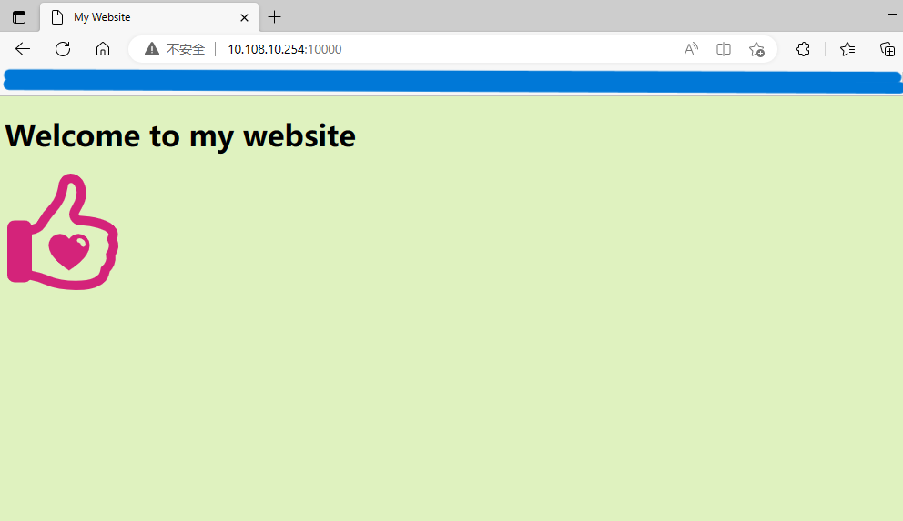
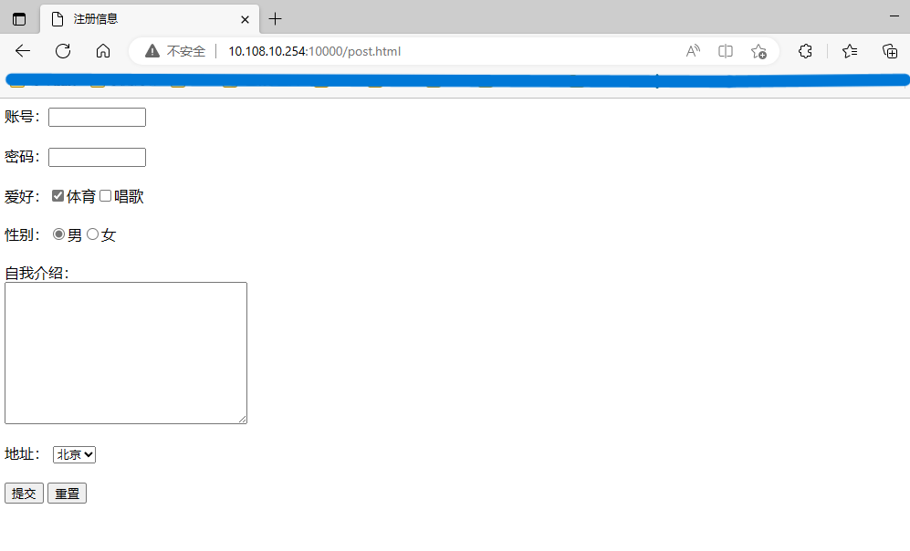
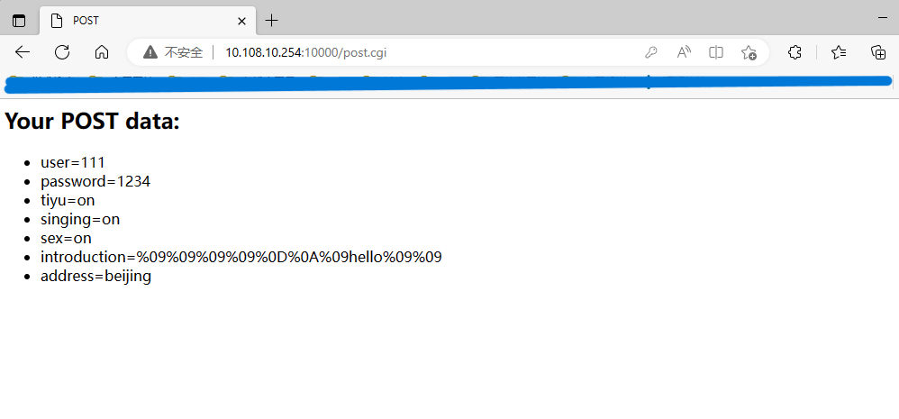

### 文件说明

- document文件夹下存放的是用于响应客户端请求的页面和图片资源。其中post.cgi是post.cpp经编译后的可执行文件。
- http.cpp文件是项目具体实现。
- post.cpp是基于C++实现的帮助服务器处理用户动态请求的CGI程序。

### 使用

1. 将项目下载到Linux服务器上，切换到项目文件夹下执行`./app`命令，即可开启服务器端的监听。默认端口号为10000，可在main函数中修改端口号，修改后重新编译运行即可。
3. 在客户端浏览器中输入后`服务器IP:端口`，服务器会返回document文件夹下的index.html文件，浏览器解析后显示出来。

4. 在客户端浏览器中输入`服务器IP:端口/post.html`后，服务器会返回document文件夹下的postx.html文件，可以在页面的输入框中输入对应的信息提交后，服务器会将提交的数据回显出来。

